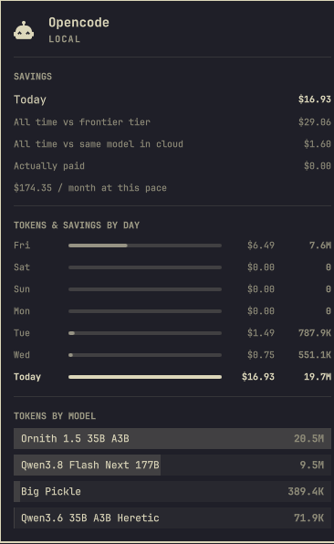

# Opencode Usage

An **Opencode** tab in the Omarchy agents panel, alongside the coding agents it
already tracks, for the models you run yourself.



Omarchy's agents panel meters subscriptions: percent of the session window
used, time until the weekly reset. A local model has none of that. It has no
window to fill and no bill to watch, which is exactly why it is worth
measuring. So this plugin reports **what the traffic would have cost** instead
of what is left of an allowance:

- **Savings**: today, all-time against a reference cloud model, all-time
  against the same models rented from a provider, and what you actually paid.
- **Tokens and savings by day**: the last week, with the dollars saved beside
  the token count.
- **Tokens by model**: every model opencode talked to, input / output / cache
  split included.

## Install

```bash
omarchy plugin add https://github.com/lkzwieder/omarchy-opencode-usage.git --enable
```

The plugin is a collector on a timer: it writes a usage record into
`~/.local/state/omarchy/agents/usage/`, which is where Omarchy's agents panel
looks. Nothing in the panel is patched or replaced. The tab simply appears,
and disappears again if you remove the plugin.

The savings sections need the panel to know about the `savings` field. Until
that lands upstream, a stock Omarchy shows the Opencode tab with tokens by day
and by model; the dollar figures are always available from the terminal:

```bash
~/.config/omarchy/plugins/opencode.usage/bin/opencode-usage
```

## How a model is priced

A model counts as **free** when opencode itself says it costs nothing, meaning
a `cost` of zero in your `opencode.json` provider block, which is how local
runtimes (llama.cpp, Ollama, vLLM, LM Studio, anything behind LiteLLM) and the
zero-cost models on hosted gateways are already declared. Everything else is
charged at its published price.

To say what the free traffic *would* have cost, each model is matched by
display name against the [models.dev](https://models.dev) catalog opencode
already caches in `~/.cache/opencode/models.json`, and the median published
price of the matches is used. Name your local model after the weights it runs
(`"name": "Qwen3.8 Flash-Next 177B"`) and the match lands on its own; name it
`gpu-2` and it falls back to a generic rate.

Nothing here is a bill. It is an estimate of a counterfactual, and it inherits
every assumption in that sentence, most of all that the same work would have
taken the same number of tokens on another model.

## Settings

`refreshIntervalSec` (default 900) in the plugin's entry in
`~/.config/omarchy/shell.json`. Force a refresh with
`omarchy-shell opencode.usage refresh`.

Overrides live in `~/.config/omarchy/agents/opencode.json`, all optional:

```json
{
  "baseline": { "name": "the model I would have used", "price": [2.0, 10.0, 0.20, 2.50] },
  "equivalents": { "sparks/spark-ornith": ["openrouter", "qwen/qwen3.6-35b-a3b"] },
  "free": ["myprovider/my-local-model"],
  "paid": ["gateway/actually-billed-model"]
}
```

| Key | What it does |
|---|---|
| `baseline` | The reference model the savings are quoted against. Prices are USD per 1M tokens, in the order input, output, cache read, cache write. Defaults to frontier-tier rates ($5 / $25 per 1M) under the neutral name `frontier tier`. |
| `equivalents` | Pin a model to an exact catalog entry instead of matching by name. Keys are `providerID/modelID` as opencode records them. |
| `free` / `paid` | Override the zero-cost detection for one model. |

## Requirements

Omarchy with the agents panel (`omarchy.agents`), opencode, Python 3, and at
least one session already recorded in `~/.local/share/opencode/opencode.db`.

## License

MIT
